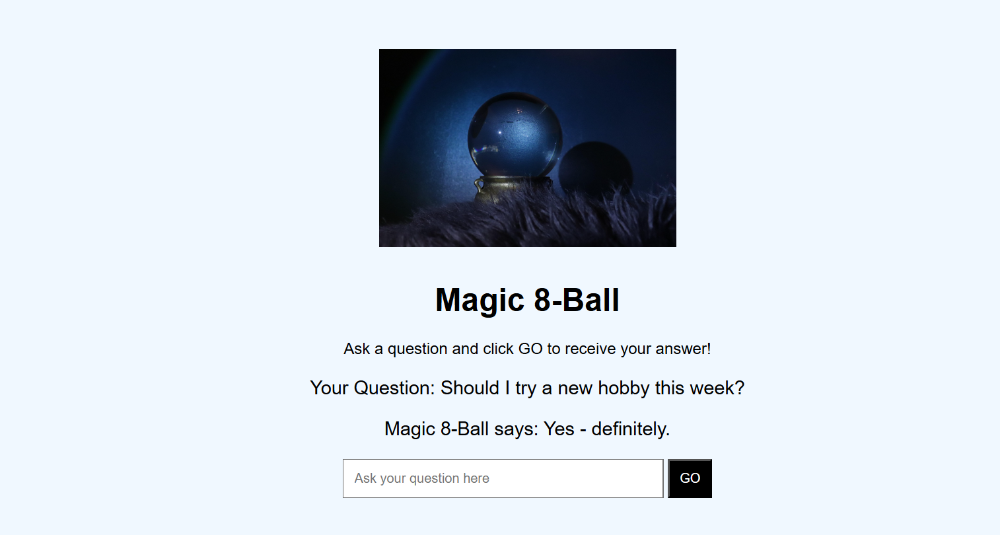

# Magic 8-Ball

Magic 8-Ball is a **fun, beginner-friendly web project** built using **HTML, CSS, and JavaScript**.  
It lets users **type a yes/no question** and receive a **random answer** from a set of 9 possible responses — just like the classic Magic 8-Ball toy.

## How to Use

1. Open `index.html` in a web browser.  
2. Type your question in the input box.  
3. Click the **GO** button to see the Magic 8-Ball's answer.  
4. The input box will clear automatically so you can ask another question.

## How It Works

- User types a question in the input box.  
- When clicking **GO**, a random number between 0 and 8 is generated.  
- That number maps to one of nine possible answers:  
  - Yes – definitely.  
  - It is decidedly so.  
  - Without a doubt.  
  - Reply hazy, try again.  
  - Ask again later.  
  - Better not tell you now.  
  - My sources say no.  
  - Outlook not so good.  
  - Very doubtful.  
- The question and the answer are displayed below the input box.  
## Project Screenshots

**Initial Page:**  

**After Asking a Question:**  

## Built With

- **HTML5** – for the page structure  
- **inline CSS** – for styling and layout  
- **JavaScript** – for the interactive logic (random answers, input handling)  

## What I Learned

- How to capture user input from the page instead of using prompt()
- How to use **`document.getElementById()`** and `.innerText` to manipulate the DOM  
- How to **generate random numbers** in JavaScript  
- Basic **UI/UX design** using inline CSS 
